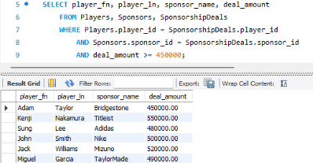
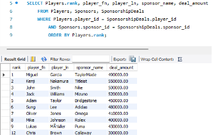
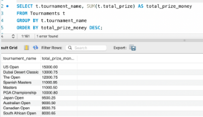
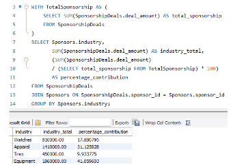
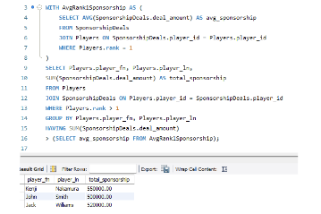
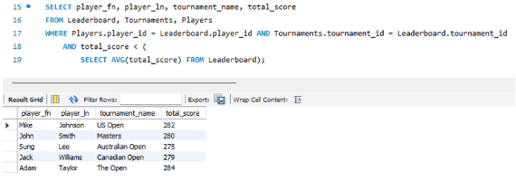
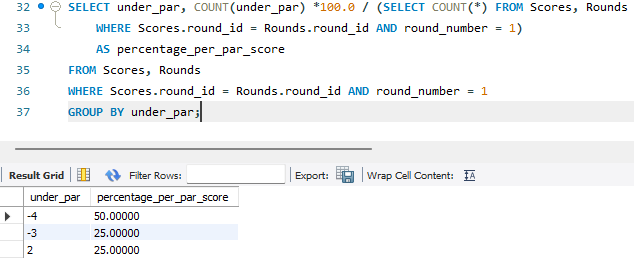
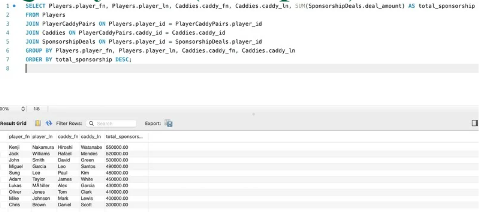

# MIST4610GroupProject1

## Team Name and Members
**group8**
- Forcucci, Enzo: https://github.com/En9o/4610-Project
- Runckel, David
- Tesfai, Ben: 
- Trotman, William: https://github.com/wptrot/MIST4610Group8Project1
  
## Scenario Description
Tasked with constructing a data model, populating its corresponding database, and formulating relevant SQL queries, my fellow group members and I landed on using the PGA Tour as the basis of our group project. The PGA Tour organizes the most prominent tournaments in the professional golf world including the four majors (The Masters, PGA Championship, US Open, & the Open Championship). Our data model provides a statistical overview of all tournaments organized by the PGA Tour including detailed records of players and their connections. In terms of managerial usage, its primary purpose is for record-keeping and statistical value which can be used by the PGA Tour and associated organizations or for recreational use by content-creators and fans of the game.

## Data Model

The PGA Tour data model contains 11 total entities, 4 of those being created from the many-to-many relationships between entities. Below will be descriptions of each entity in order of importance regarding their value and number of relationships.

**1.** Players: The Players entity is the core entity within the PGA Tour data model with 5 individual relationships. It serves to represent each individual player associated and recorded in the PGA Tour. It contains the player's unique ID, first name, last name, date of birth, year they turned pro, rank, points, and country of each player recorded in the database. The country of each player is integrated into the Players entity through the one-to-many relationship between Countries and Players. This relationship is further explained in the Countries entity. Two attributes that may require further clarification are rank and points. Rank is simply what each player's current or last recorded rank is among their peers while points are a score-based system recorded by the official PGA for each player, allocated based on individual performance within tournaments that the player participated in.

**2.** Tournaments: The PGA Tour orchestrates multiple tournaments for professional golfers to compete in. The Tournaments entity is another primary entity within the PGA Tour data model. It stores data revolving around each tournament played tied to the PGA Tour. It has a many-to-many relationship with Players in the form of the Leaderboard entity.

**3.** Leaderboard: The Leaderboard entity stores data on the players' performance in each individual tournament. It holds their score at the end of the tournament along with their finishing position within. The leaderboard doesn't store the player's overall position in the PGA Tour, just their ending position in that singular tournament.

**4.** Rounds: The Rounds entity stores individual round data from each tournament. There are many rounds in a tournament. This is why the Rounds entity is on the "many" end of the one-to-many relationship with Tournaments. It stores the round number and the day the round was on.

**5.** Scores: Each player receives a score after each round in a tournament based on their performance. It is the resultant entity from the many-to-many relationship between Players and Rounds. The Scores entity stores the player ID and round ID so it can tie the scores in that round to each correct player.

**6.** Sponsors: Sponsors are business entities that contribute money to the PGA Tour and individual players. They help the Tour operate and represent the business side of professional golf.

**7.** SponsorshipDeals: Sponsorship Deals are strictly the deals between players and sponsors. Recorded in this entity are the connected player's and sponsor's ID along with the amount of the deal struck between the two parties.

**8.** Caddies: Caddies are the on-course helpers of the players. A player can only have one caddy and caddies can only assist a single player.

**9.** PlayerCaddyPairs The bonding entity between Players and Caddies. It stores the individual IDs of the players and caddies as a composite primary key.

**10.** Countries: The Countries entity has two separate one-to-many relationships with the Players and Courses entities. This is because each country can have many players from there and possess multiple courses within its borders.

**11.** Courses: The Courses entity represents courses used in tournaments held by the PGA Tour. Within is each course's unique ID, name, par score, total length, and country where it resides. The country is integrated by the one-to-many relationship between Countries and Courses. 

## Data Dictionary
**Players Table**
| Column Name | Description | Data Type | Size | Format | Key |
|:------------|:------------|:----------|:-----|:-------|:----|
| player_id | primary key of Players table | INT | | | PK |
| player_fn| first name of player | VARCHAR | 45 | | |
| player_ln | last name of player | VARCHAR | 45 | | |
| date_of_birth| date players were born | DATE | | YYYY/MM/DD | |
| turned_pro_year| date players became pro golfers | DATE | | YYYY/MM/DD | |
| rank | current rank of the player among peers | INT | | | |
| points | current total points from all tournaments player participated in that season | DECIMAL | (10,2) | | |
| country_id | foreign key of Countries table recording where each player is from | INT | | | FK |

**Tournaments Table**
| Column Name | Description | Data Type | Size | Format | Key |
|:------------|:------------|:----------|:-----|:-------|:----|
| tournament_id | primary key of Tournaments Table | INT | | | PK |
| tournament_name | name of tournament | VARCHAR | 45 | | |
| start_date | date the tournament began | DATE | | YYYY/MM/DD | |
| end_date | date the tournament ended | DATE | | YYYY/MM/DD | |
| total_prize | cash reward for the winners of the tournament | DECIMAL | (15,2) | | |

**Leaderboard Table**
| Column Name | Description | Data Type | Size | Format | Key |
|:------------|:------------|:----------|:-----|:-------|:----|
| tournament_id | composite primary key from one-to-many relationship with Tournaments Table | INT | | | PK |
| player_id | composite primary key from one-to-many relationship with Players Table | INT | | | PK |
| total_score | total score the player had during the tournament | INT | | | |
| position | finishing position of the player in the tournament | INT | | | |

**Rounds Table**
| Column Name | Description | Data Type | Size | Format | Key |
|:------------|:------------|:----------|:-----|:-------|:----|
| round_id | primary key of Rounds Table | INT | | | PK |
| round_number | which round it is within the tournament | INT | | | |
| round_date | day the round was held | DATE | | YYYY/MM/DD | |
| tournament_id | foreign key of Tournaments Table recording which tournament the round is part of | INT | | | FK |

**Scores Table**
| Column Name | Description | Data Type | Size | Format | Key |
|:------------|:------------|:----------|:-----|:-------|:----|
| score_id | primary key of Scores Table | INT | | | PK |
| player_id | foreign key from Players Table serving as a composite primary key | INT | | | PK |
| round_id | foreign key from Rounds Table serving as a composite primary key | INT | | | PK |
| strokes | total strokes taken by the player in that round | INT | | | |
| under_par | +/- value of player based on performance on holes in the round | INT | | | |

**Sponsors Table**
| Column Name | Description | Data Type | Size | Format | Key |
|:------------|:------------|:----------|:-----|:-------|:----|
| sponsor_id | primary key of Sponsors Table | INT | | | PK |
| sponsor_name | name of the sponsor | VARCHAR | 45 | | |
| industry | what industry the sponsor belongs to | VARCHAR | 45 | | |

**SponsorshipDeals Table**
| Column Name | Description | Data Type | Size | Format | Key |
|:------------|:------------|:----------|:-----|:-------|:----|
| deal_id | primary key of the SponsorshipDeals Table | INT | | | PK |
| player_id | foreign key from Players Table serving as a composite primary key | INT | | | PK |
| sponsor_id | foreign key from Sponsors Table serving as a composite primary key | INT | | | PK |
| deal_amount | sponsorship amount paid to the player | DECIMAL | (15,2) | | |

**Caddies Table**
| Column Name | Description | Data Type | Size | Format | Key |
|:------------|:------------|:----------|:-----|:-------|:----|
| caddy_id | primary key of the Caddies Table | INT | | | PK |
| caddy_fn | first name of the caddy | VARCHAR | 45 | | |
| caddy_ln | last name of the caddy | VARCHAR | 45 | | |

**PlayerCaddyPairs Table**
| Column Name | Description | Data Type | Size | Format | Key |
|:------------|:------------|:----------|:-----|:-------|:----|
| player_id | foreign key from Players Table serving as a composite primary key | INT | | | PK |
| caddy_id | foreign key from Caddies Table serving as a composite primary key | INT | | | PK |

**Countries Table**
| Column Name | Description | Data Type | Size | Format | Key |
|:------------|:------------|:----------|:-----|:-------|:----|
| country_id | primary key of Countries Table | INT | | | PK |
| country_name | name of the country | VARCHAR | 45 | | |

**Courses Table**
| Column Name | Description | Data Type | Size | Format | Key |
|:------------|:------------|:----------|:-----|:-------|:----|
| course_id | primary key of the Courses Table | INT | | | PK |
| course_name | name of the course | VARCHAR | 45 | | |
| par | aggregate score recorded by the sum of all par values for each hole on the course | INT | | | |
| length | total length of the entire course recorded by the sum of lengths of each hole | DECIMAL | (5,2) | | |
| country_id | foreign key from the Countries Table to show what country the course is in | INT | | | FK |

## Ten Queries
**Simple Queries**

**1.** Query #1 returns the first and last name of the player along with their sponsorship partner and amount if the deal amount is over $450,000. This could be used by sponsors or players' agents to negotiate deals by filtering deal amounts to try and argue a certain $ amount.

**2.** Query #2 returns the order of sponsorship amounts associated with each player ordered by their current rank in the PGA Tour. Using this data can give users an idea of whether or not there's a correlation between player rank and the amount of sponsorships they receive along with the amount of each.

**3.** Query #3 returns the total prize money awarded to the winners of each tournament and orders them by total amount. This can help users understand which tournaments are perceived as the most prestigious or important within the PGA Tour. 

**4.** Query #4 shows the user the number of courses in the PGA Tour grouped by each country. This helps users get a grasp of where most tournaments are played in the PGA Tour. One potential flaw is how it doesn't explain why a country may have more courses than another. Is it a geographical advantage or maybe just historical courses getting priority over others? There are numerous questions that could be levied against this query given its simplicity.

**Complex Queries**

**5.** Query #5 returns the total sum of sponsorship deals grouped by industry. Along with this is the total percentage regarding all sponsorships for the PGA Tour. What makes this so valuable as a piece of data is how users, especially potential and current investors/sponsors can see what their industry is currently contributing to the PGA Tour and whether it is economically advantageous to form a deal.

**6.** Query #6 specifically returns the names and sponsorship amounts of players who make more than the number one ranked player. This data is focused on sponsors and player agents regarding contract negotiations. For example, if the ranked one player sees that there are a large amount of people earning more in sponsorship money compared to themselves, they can urge their agent to reach out to sponsors. Also, if a sponsor sees one of their players is making way more money than the highest ranked player, they may elect to renegotiate the deal.

**7.** Query #7 returns players and their total score in a tournament only if their score is lower than the average total score among all tournaments recorded in the database. This query possesses value primarily for fans of the game who want to see historical data regarding total tournament scores. However, because the tournament's name is also included in the response, a trend could be formed in one's head on whether certain tournaments are easier and possess more lower than average scores than other tournaments. What would have enhanced this query even further would be the inclusion of the course name to see whether there existed a trend there but the data model doesn't support this interaction due to only realizing this connection after the fact.

**8.** Query #8 returns the 8 lowest point totals between golfer-caddy pairs. This query primarily is oriented toward statisticians who want to see historic underperforming pairs filtered to a certain amount of pairs for a quicker response, especially when in reality there exists thousands of pairs. 

**9.** Query #9 returns the percentage of scores under or over par, particularly in the first round of a tournament. The value of a query like this comes from an analytical perspective. Users can manipulate the round number and see patterns regarding under/over par values based on the round number. Perhaps there are more under-par values in early rounds because players are fresher for example. With a query like this, even players can utilize the data to perhaps save their energy in earlier rounds to perform greater in later rounds to gain an advantage in the standings.

**10.** Query #10 is another sponsorship deal query used to display earnings between players and their caddies. This adds an additional element regarding caddies and how they may impact sponsorship amounts and give a wider perspective on deals between sponsors and players. For example, a highly renowned caddy or well-known one may assist the player in getting more sponsorship deals.

## Database Information
**Queries**
|   | Query 1 | Query 2 | Query 3 | Query 4 | Query 5 | Query 6 | Query 7 | Query 8 | Query 9 | Query 10 |
|:--|:--------|:--------|:--------|:--------|:--------|:--------|:--------|:--------|:--------|:---------|
| function | | | X | X | X | X | X | X | X | X |
| group by | | | X | X | X | X | | | X | X |
| having | | | | | | X | | | | |
| limit | | | | | | | | X | | |
| multiple condition where | X | X | | | | | X | | X | |
| multiple table join | X | X | | X | X | X | X | X | X | X |
| order by | | X | X | | | | | X | | X |
| subquery | | | | | X | X | X | | X | |

**ha_group8**

Stored Procedure Format: TP_Qx (x:1-10)

Presentation Link: https://www.canva.com/design/DAGRxuPISMg/KVZ8mDdSKbaAsiLlrXUE0Q/edit?utm_content=DAGRxuPISMg&utm_campaign=designshare&utm_medium=link2&utm_source=sharebutton
